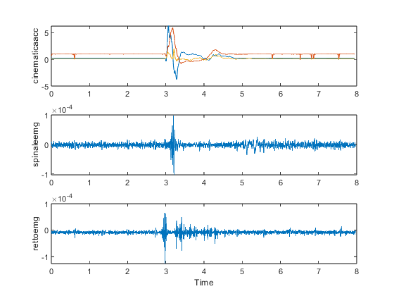

## MATLAB Utility for Processing Delsys EMG Data

This repository provides a MATLAB function, `extract_delsys_data`, designed to simplify and process data exported from the **Delsys Trigno Wireless EMG system**. I have found the exported data from the [Delsys File Utility](https://delsys.com/support/software/) organized in a complex structure, making it challenging to work with directly. This function facilitates data extraction, transformation, and resampling, aiming to provide a data structure easier to work with. 


### Key Features

1. *Simplified Data Extraction*: The function extracts specific channels and fields from the Delsys data structure, streamlining the transformation process.

2. *Resampling Capability*: Handles variations in sampling frequencies across different sensors by providing a resampling option. This ensures consistent sampling rates for synchronized analysis.

3. *Optional Data Plotting*: Includes a plotting feature to visualize the processed data directly from MATLAB.


### Example Usage

```matlab
% Load Delsys exported data
data_path = 'data.mat';

% Define channels and fields to extract
names = {
    'muscle1', 'emg', 500;  % Extract emg data from channel muscle1 and resample to 500 Hz
    'hand2', 'acc', 50    % Extract accelerometer data from channel hand2 and resample to 50 Hz
};

% Extract and resample data with visualization
datastreams = extract_delsys_data(data_path, names, 1, 1);
```

The result will be something like this: 



Check out `test_extract_delsys.m` for a working example. 

### License

This project is licensed under the [EUPL v1.2](https://eupl.eu/1.2/en/) License.